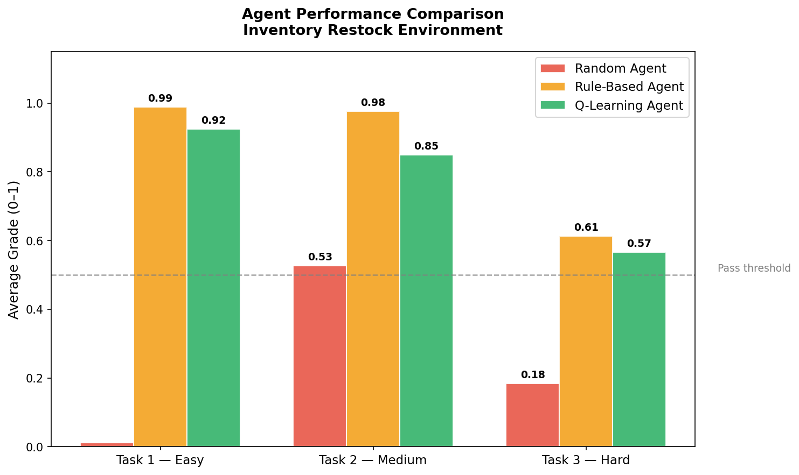
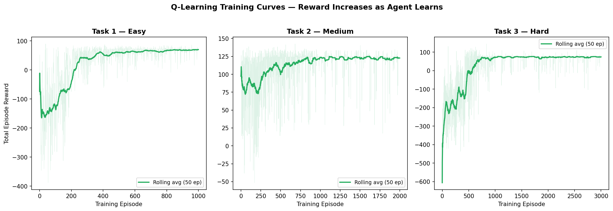

# ⚙️ Inventory Optimization under Uncertainty using Reinforcement Learning

---

## 🗺️ Overview

Inventory control is not just a logistics problem — it is a **sequential decision problem under uncertainty**.

Organizations must continuously balance:

* Lost revenue from unmet demand
* Cost of holding excess inventory

This project models inventory management as a **Markov Decision Process (MDP)** and evaluates how different decision policies behave across increasing levels of stochastic volatility.

---

## ⚡ Demo

[](https://colab.research.google.com/drive/1KahVbQ5fgXFSf2oCXWbiA-vD6P6VmMve?usp=sharing)

> Full pipeline: training → evaluation → visualization

---

## ⚖️ Problem Framing

We simulate a simplified supply chain where decisions must be made daily:

* Restock too little → stockouts and lost sales
* Restock too much → holding cost and inefficiency

The objective is to learn a **balanced decision policy that maximizes long-term reward**.

---

## 📐 Methodology

### Environment Design

At each step:

* **State includes:**

  * current inventory level
  * daily demand
  * pending orders (lead time)

* **State Representation:**
  Continuous values were discretized into bins, enabling efficient tabular learning while maintaining meaningful decision boundaries. This helps manage the **curse of dimensionality** while preserving decision quality.

* **Action:**

  * restock quantity (0–50 units)

* **Reward:**

  * +1 → unit sold
  * -2 → unmet demand (stockout penalty)
  * -0.1 → excess inventory (holding cost)
  * -0.5 → ignoring low inventory

---

## 🎓 Learning Mechanism

The Q-learning agent updates its policy using:

$$
Q(s, a) \leftarrow Q(s, a) + \alpha \left[r + \gamma \max_{a'} Q(s', a') - Q(s, a)\right]
$$

---

## 🧩 Agents Compared

* Random Policy → baseline
* Rule-Based Policy → heuristic strategy
* Q-Learning Agent → learning-based policy

---

## 📈 Results

### Agent Comparison



### Learning Behaviour



| Agent            | Easy | Medium | Hard | Avg  |
| ---------------- | ---- | ------ | ---- | ---- |
| Random Agent     | 0.01 | 0.52   | 0.18 | 0.24 |
| Rule-Based Agent | 0.98 | 0.97   | 0.61 | 0.85 |
| Q-Learning Agent | 0.97 | 0.73   | 0.54 | 0.75 |

---

## 🔍 Interpretation

* Rule-based policies perform strongly in **predictable environments**
* Q-learning demonstrates **adaptive learning behaviour**
* Under uncertainty, RL gradually improves and approaches heuristic performance

This reflects a key principle:

> Heuristics encode prior knowledge
> Learning systems acquire knowledge through interaction

---

## 🏬 Business Perspective

Compared to the random baseline, the learned policy significantly reduces inefficient decisions such as stockouts and overstocking.

In a real-world system, this translates into:

* improved service reliability
* reduced inventory waste
* more stable supply chain operations

---

## 🧱 Limitations

* Tabular Q-learning limits scalability
* Discretization reduces precision
* Synthetic demand (no real-world data)

---

## 🔭 Future Work

* Deep Q-Network (DQN)
* Multi-product inventory system
* Real-world demand integration
* Extended horizon evaluation

---

## 📁 Project Structure

env/        → environment (MDP simulation)
agents/     → decision policies
analysis/   → evaluation logic
results/    → charts & outputs
train.py    → execution pipeline

---

## 💻 Execution

```bash
pip install -r requirements.txt
python train.py
```

---

## 💡 Core Insight

The goal is not to replace heuristics blindly.

The real insight:

> Use heuristics when systems are stable
> Use reinforcement learning when systems are uncertain

---

## ✍️ Author

Pushkar Pradhan
